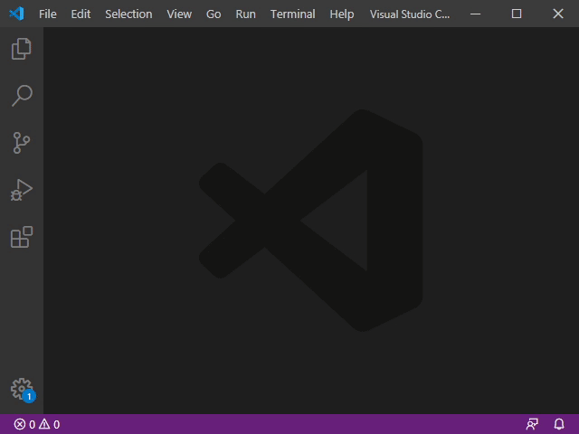

# Heck README

This extension provides basic support for editing with the [Heck programming language](https://heck-lang.github.io).

## Features

The proper syntax highlighting will be applied when creating or opening a file with the `.heck` file extension:

## Release Notes

### 0.0.8

add support for nested block comments